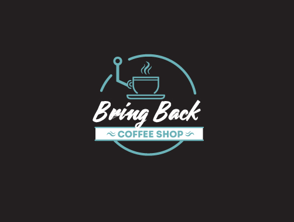

# Bring Back Coffee Shop
<h3 align="center">
    
    <p>
    E-commerce de uma cafeteria vintage com Python/Flask
    </p>
</h3>

> [Vídeo completo mostrando o site]()

# Sumário

* [INTRODUÇÃO](#bring-back-coffee-shop)
* [SUMÁRIO](#sumário)
* [TECNOLOGIAS](#tecnologias)
  * [PRÉ-REQUISITOS](#pré-requisitos)
* [FUNCIONALIDADES](#funcionalidades)
* [TELAS DO SITE - PREVIEWS](#telas-do-site)
  * [HOMEPAGE](#homepage)
  * [LOGIN E CADASTRO](#login-e-cadastro)
  * [PRODUTOS](#produtos)
  * [CARRINHO](#carrinho)
  * [LOGOUT](#logout)
  * [ADMIN](#admin)
* [Entre em contato!](#entre-em-contato)

# Tecnologias

Nesse projeto foram usadas as seguintes tecnologias:
- [Python](https://www.python.org)
- [Flask Microframework](https://flask.palletsprojects.com/en/2.1.x/)
  - [Flask WTForms](https://flask-wtf.readthedocs.io/en/1.0.x/)
  - [Flask SQLAlchemy](https://flask-sqlalchemy.palletsprojects.com/en/2.x/)
  - [Flask User](https://flask-user.readthedocs.io/en/latest/)
  - [Flask Migrate](https://flask-migrate.readthedocs.io/en/latest/)

### Pré-requisitos
Para ver todos, consulte o requirements.txt, ou faça a instalação pelo comando:
```console
$ pip install -r requirements.txt
```

Se quiser instalar separadamente:

Instalando Flask, Flask SqlAlchemy, Flask Migrate, Flask WTForms, Flask User
```console
$ pip install Flask
$ pip install -U Flask-SQLAlchemy
$ pip install Flask-Migrate
$ pip install -U Flask-WTF
$ pip install Flask-User
```

Inicialização do Banco de Dados 
```console
$ flask db init
$ flask db migrate -m "Initial migration."
$ flask db upgrade
$ flask db --help
```

# Funcionalidades
Features do projeto:
- Login e Cadastro com banco de dados
- Vista geral de todos os produtos
- Vista individual de um produto
- Escolher a quantidade do produto para por no carrinho
- Carrinho
- Separação por categorias que são especificadas na hora do cadastro do produto
- Filtragem por ordem alfabética, por preço crescente e por preço decrescente
- Área para o administrador ter um fácil acesso à adição, edição, exclusão e leitura (dashboard) dos produtos

# Telas do Site

[Template base](https://freemiumdownload.com/downloads/e-shopper-free-ecommerce-html-template/)
## Homepage
<h3 align="center">
    
</h3>

---

## Login e Cadastro

<h3 align="center">
    
</h3>

---

## Produtos

### Todos os Produtos

<h3 align="center">
    
</h3>

### Produto Individual

<h3 align="center">
    
</h3>

### Categorias e Filtros

<h3 align="center">
    
</h3>

---

## Carrinho

<h3 align="center">
    
</h3>

---

## Admin
Área para os administradores/donos do e-commerce poderem gerenciar os produtos facilmente

### Dashboard
<h3 align="center">
    
</h3>

### Adicionar Protudo
<h3 align="center">
    
</h3>

---

# Entre em contato!

> [Linkedin](https://www.linkedin.com/in/beatriz-vidal-a2b114200) | [Instagram](https://www.instagram.com/bvidalf/) | [E-mail](mailto:biavidalf@gmail.com) 👋
>
> Made by Beatriz Vidal ❤🎯